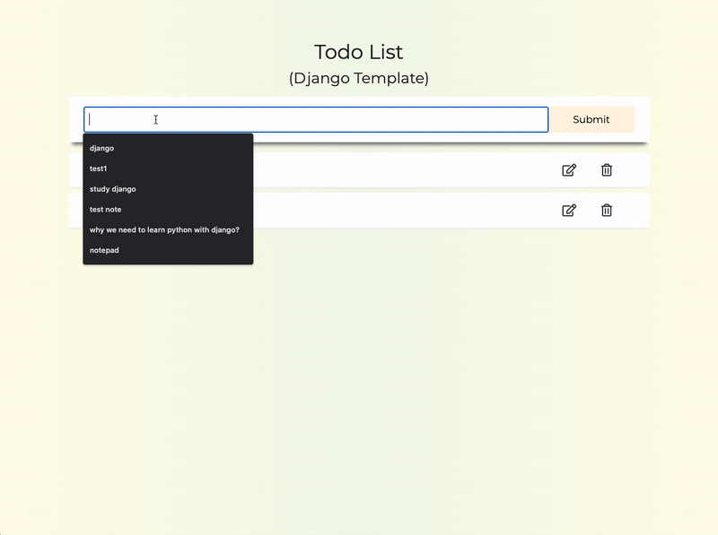

# Todo App (Django Template)
what Django is all about. basics of creating a simple todo app.

## Django Template

## Live Demo
Try the application live at [https://jinhomyung.pythonanywhere.com/](https://jinhomyung.pythonanywhere.com/)

## Technologies Used
- HTML
- CSS Variables 
- Django
- Django Template

## Features
  - Responsive design
  - User can write todo
  - User can update todo
  - User can delete todo
  - User can check completion of todo

## Preview

